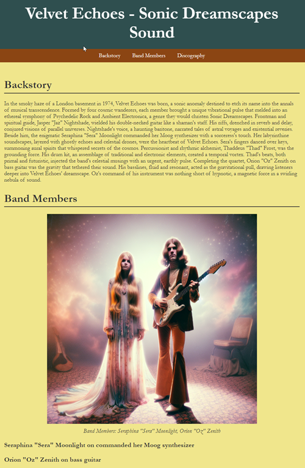

# AI-BandMaker 🎸🤖

**AI-BandMaker** is your ultimate tool for creating imaginative fan pages for fictional bands, powered by advanced AI technologies! Whether you're a music enthusiast, creative writer, or AI hobbyist, this app breathes life into fictional bands with unique profiles, compelling backstories, custom discographies, and original music tracks.  The app uses a unique Author Style, Nationality, Genre 1, Genre 2, Post-Punk, Style Name, and a Year active.

## ✨ Feature List

- **Unique Band Profiles**: Automatically generate creative band names, genres, styles, and captivating backstories.
- **AI-Generated Backstories**: Produce engaging narratives exploring the band's history, members, and journey, all written by OpenAI's GPT.
- **Custom Discographies**: Create detailed albums complete with imaginative titles and track lists that reflect the band's evolving themes.
- **Original Music Creation**: Leverage the Suno API to compose a unique music track that matches the band's genre and vibe.
- **Visual Content Generation**: Generate band member portraits and promotional images using OpenAI's DALL-E.
- **Beautiful HTML Fan Pages**: Compile all generated content into a stunning, ready-to-share HTML fan page.

## 🚀 Getting Started

### Prerequisites

- Python 3.x installed on your machine.
- API keys for OpenAI and Suno.

### Installation

1. **Clone this repository**:

    ```bash
    git clone https://github.com/jasona7/ai-bandmaker.git
    cd ai-bandmaker
    ```

2. **Install the dependencies**:

    ```bash
    pip install -r requirements.txt
    ```

3. **Set up your API keys**:

    Ensure you have your API keys ready for OpenAI. Set it as an environment variable:

    ```bash
    export OPENAI_API_KEY='your_openai_api_key'
    ```
    
### 🎨 Usage

1. **To start generating your AI-powered band fan page, simply run**:

```bash
python createAct.py
```

    The script will do the following:

    Generate a detailed band profile with a unique backstory.
    Create a comprehensive discography with albums and tracks.
    Generate an original music track using Suno.
    Produce visual assets like band photos.
    Compile everything into a stunning HTML fan page.

    Example Output
    Below is an example of the fan page generated by AI-BandMaker


   

#### Logging
    The execution.log file holds the runtime actions during each script execution.  INFO level
     logging details are captured including band backstory, band membes, dicography, and track listings:

    2024-08-30 20:32:35,476 - INFO - Script execution started.
    2024-08-30 20:32:39,454 - INFO - Raw band profile response: Band Name: The Electric Reverie
    Author Style: Lester Bangs meets Hunter S. Thompson
    Nationality: British
    Genre 1: Psychedelic Rock
    Genre 2: Post-Punk
    Style Name: Neo-Victorian Psychedelia
    Reference Year: 1983

    Imagine, if you will, a sonic landscape where the ghostly echoes of Victorian ballrooms meet the gritty, raw energy of a post-industrial Britain. Enter The Electric Reverie, a British ensemble that emerged from the smoggy streets of London in the early '80s, weaving a tapestry of sound that defies conventional boundaries. Their essence is aptly captured in the term 'Neo-Victorian Psychedelia,' a style that marries the ornate, almost baroque sensibilities of the 19th century with the mind-bending expansiveness of psychedelic rock, all filtered through the angular, jagged lens of post-punk.

    Fronted by the enigmatic and eternally aloof Alistair Grimshaw, The Electric Reverie is not just a band but a phenomenon—a surreal trip down cobblestone streets that dissolve into cosmic voids. Their 1983 debut album, "Etheric Visions," is a testament to their audacious fusion of genres, featuring tracks that oscillate between hauntingly beautiful melodies and frenetic, anarchic bursts of energy. Critics, often at a loss for words, have described their live performances as a "Victorian séance conducted at a punk squat."

    In a landscape dominated by synth-pop and burgeoning new wave acts, The Electric Reverie carved out a niche all their own, earning a cult following that spans generations. Their music is a time machine, a transcendental journey that challenges listeners to rethink the very fabric of reality itself.
    2024-08-30 20:32:39,454 - INFO - Generated band profile: {'Band Name': 'The Electric Reverie', 'Author Style': 'Lester Bangs meets Hunter S. Thompson', 'Nationality': 'British', 'Genre 1': 'Psychedelic Rock', 'Genre 2': 'Post-Punk', 'Style Name': 'Neo-Victorian Psychedelia', 'Reference Year': 1983}
    2024-08-30 20:32:39,456 - INFO - Directory 'TheElectricReverie' created for the project output.
    2024-08-30 20:32:43,730 - INFO - Generated backstory: In the fog-choked streets of Thatcher's Britain, a sonic revolution was brewing. Enter: The Electric Reverie, a Neo-Victorian Psychedelia act born in 1983, fusing the lysergic tapestry of Psychedelic Rock with the raw aggression of Post-Punk. Their sound is a time machine, where Victorian elegance clashes head-on with electric anarchy.

    Front and center is Alistair "The Alchemist" Harrington, a mad scientist of vocals and theremin, whose voice could summon specters. Draped in velvet waistcoats and lace cravats, he wields his theremin like a sorcerer, conjuring eerie wails that dance with his baritone growl.

    On guitar, we have Celeste "Clockwork" Montgomery, a virtuoso with a penchant for ruffled shirts and brass goggles. Her custom-built, steampunk-inspired guitar, "The Tesla," is a beast of gears and coils that channels riffs from another dimension, blending Victorian aesthetics with futuristic feedback.

    Bassist Jasper "The Undertaker" Caldwell is the backbone, cloaked in a long, dark trench coat. His bass, "The Iron Maiden," is a monstrous relic, delivering doom-laden grooves that rumble like Victorian steam engines. Jasper's ominous presence on stage is a testament to the gothic undertones that haunt their music.

    Percussion genius Eleanor "Elysium" Blackwood is a whirlwind behind her hybrid drum kit, a contraption of brass and mahogany. Her rhythms are a blend of militaristic precision and tribal chaos, driving the band through labyrinthine soundscapes with relentless energy.

    Together, The Electric Reverie crafts an auditory opium den, where the past and future collide in a kaleidoscopic explosion of sound and vision. They are not just a band; they are an epoch unto themselves, a living, breathing anachronism in the heart of the 1980s. Join the Reverie and lose yourself in the electric dream.
    2024-08-30 20:32:54,524 - INFO - Extracted band members from backstory: []
    2024-08-30 20:32:59,795 - INFO - Generated discography response: ### Album Title 1: "Spectral Mechanisms"

    #### Tracklist:
    1. "Fogbound Wasteland"
    2. "Aetheric Whispers"
    3. "Victorian Vortex"
    4. "Clockwork Heartbeat"
    5. "Echoes of Gaslight"
    6. "The Alchemist's Lament"
    7. "Steam-Powered Dreams"
    ...

    ### Album Title 2: "Opium Den of Time"

    #### Tracklist:
    1. "Etheric Embers"
    2. "Midnight Mechanica"
    3. "Victorian Paradox"
    4. "Lace and Rust"
    5. "The Tesla's Lullaby"
    6. "Punked Phantoms"
    7. "Gothic Steam"
    8. "Elysium's Fury"
    ...


    ### Album Title 3: "Electric Epitaphs"

    #### Tracklist:
    1. "Spectral Overture"
    2. "Celestial Gears"
    3. "Opium of the Specter"
    4. "The Alchemist's Grimoire"
    5. "Aether Anarchy"
    6. "Clockwork Cathedrals"
    7. "Jasper's Elegy"
    8. "Elysium's Dreamscape"
    9. "Victorian Haunt"
    
    2024-08-30 20:32:59,795 - INFO - Parsed albums: [('### Album Title 1: "Spectral Mechanisms"', []), ('#### Tracklist:', ['1. "Fogbound Wasteland"', '2. "Aetheric Whispers"', '3. "Victorian Vortex"', '4. "Clockwork Heartbeat"', '5. "Echoes of Gaslight"', '6. "The Alchemist\'s Lament"', '7. "Steam-Powered Dreams"', '8. "Elysium\'s March"', '9. "Ironclad Reverie"', '10. "Spectral Serenade"', '11. "The Undertaker\'s Dirge"', '12. "Time Traveler\'s Hymn"', '13. "Gears of the Cosmos"', '14. "Velvet Apparitions"', '15. "Phantasmagoria"']), ('### Album Title 2: "Opium Den of Time"', []), ('#### Tracklist:', ['1. "Etheric Embers"', '2. "Midnight Mechanica"', '3. "Victorian Paradox"', '4. "Lace and Rust"', '5. "The Tesla\'s Lullaby"', '6. "Punked Phantoms"', '7. "Gothic Steam"'])]
    2024-08-30 20:33:14,058 - INFO - Image saved to TheElectricReverie/band_photo.jpg
    2024-08-30 20:33:14,059 - INFO - HTML file 'home.html' created successfully in directory 'TheElectricReverie'.
    2024-08-30 20:33:14,059 - INFO - Script executed successfully.
    2024-08-30 20:33:14,059 - INFO - Script execution ended.


    Feel free to customize the generated content to better fit your vision or share it directly!

🤝 ### Contributing
    We welcome contributions! If you have ideas for new features or improvements, please follow these steps:

    Fork the repository.
    Create a new branch (git checkout -b feature-branch).
    Make your changes and commit them (git commit -am 'Add new feature').
    Push to the branch (git push origin feature-branch).
    Create a new Pull Request.

📜 ### License
This project is licensed under the MIT License - see the LICENSE file for more details.

🙏 Acknowledgments
Big thanks to OpenAI for their groundbreaking GPT and DALL-E models.
Thanks to Suno for providing the innovative music generation API.
Special shoutout to the open-source community and Developer X for ongoing inspiration and support.