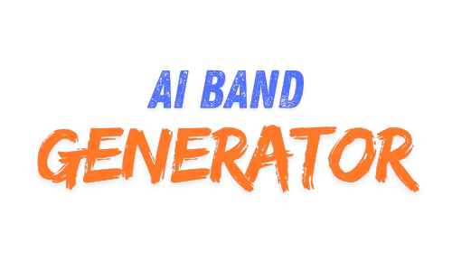
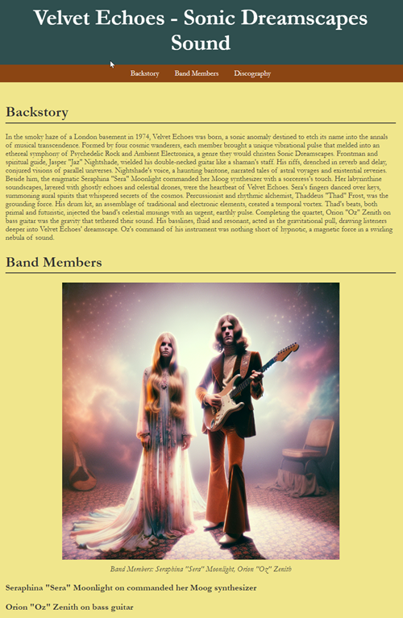

# 🎸 AI Band Generator

**Create fictional bands with AI-powered creativity!**

A modern web application that generates complete band profiles, backstories, discographies, and stunning visuals using OpenAI's GPT and DALL-E. Perfect for music enthusiasts, creative writers, and anyone excited about AI-generated content.



## 🌟 **What Makes This Special**

✨ **Complete Band Creation**: Names, genres, backstories, members, and discographies  
🎨 **AI-Generated Visuals**: Professional band photos created with DALL-E  
🌐 **Modern Web Interface**: Beautiful, responsive design with real-time progress  
📱 **Mobile-Friendly**: Works perfectly on all devices  
🎯 **Instant Results**: From idea to full band page in under 2 minutes  

## 🚀 **Quick Start (Web App)**

### 1. **Set Your API Key**
```bash
export OPENAI_API_KEY='your_openai_api_key_here'
```

### 2. **Install Dependencies**
```bash
pip install -r requirements.txt
```

### 3. **Launch the Web App**
```bash
./start_webapp.sh
```

### 4. **Open Your Browser**
Navigate to `http://localhost:5000` and start creating bands!

## 🎨 **Features**

### � **Modern Web Interface**
- **Landing Page**: Stunning hero section with compelling features showcase
- **Real-Time Generation**: Watch your band come to life with live progress updates
- **Band Gallery**: Browse all generated bands with beautiful card layouts
- **Responsive Design**: Perfect experience on desktop, tablet, and mobile

### 🤖 **AI-Powered Generation**
- **Unique Band Profiles**: Creative names, genres, and styles
- **Rich Backstories**: Engaging narratives with band member details
- **Custom Discographies**: Multiple albums with imaginative track listings
- **Professional Photos**: AI-generated band images that match their style
- **Multiple Genres**: From Psychedelic Rock to Synthwave and beyond

### 📱 **User Experience**
- **One-Click Generation**: Simple, intuitive interface
- **Progress Tracking**: 7-stage visualization of the creation process
- **Instant Access**: Direct links to view and share generated bands
- **Gallery Browsing**: Explore all previously created bands

## 🛠 **What Gets Generated**

Each AI band includes:

- 🎵 **Band Profile**: Name, nationality, genres, style, and era
- 📖 **Backstory**: Rich narrative written in the style of famous music critics
- 👥 **Band Members**: Detailed member profiles with instruments
- 💿 **Discography**: 3 albums with 10-15 tracks each
- 📸 **Band Photo**: AI-generated promotional image
- 🌐 **Fan Page**: Beautiful HTML page showcasing everything

## 📸 **Example Output**

Here's what the AI creates - **The Electric Reverie** (Neo-Victorian Psychedelia, 1983):



*Complete with backstory, band members, three full albums, and AI-generated photo!*

## 🎯 **Perfect For**

- 🎵 **Music Enthusiasts**: Explore fictional music history
- ✍️ **Creative Writers**: Generate bands for stories and world-building
- 🎮 **Game Developers**: Create bands for fictional universes
- 🎨 **Artists**: Inspiration for visual and musical projects
- 🤖 **AI Enthusiasts**: Experiment with creative AI applications
- 📚 **Educators**: Teach about music history and genres

## 🔧 **Technical Stack**

- **Backend**: Flask (Python) with OpenAI API integration
- **Frontend**: Modern HTML5, CSS3, JavaScript with Bootstrap 5
- **AI Services**: OpenAI GPT-4 for text, DALL-E for images
- **Styling**: Custom CSS with animations and responsive design
- **Icons**: Font Awesome
- **Fonts**: Google Fonts (Orbitron, Roboto)

## 📁 **Project Structure**

```
├── app.py                   # Flask web application
├── createAct.py            # Original CLI script (still works!)
├── start_webapp.sh         # Easy startup script
├── requirements.txt        # Dependencies
├── templates/              # HTML templates
│   ├── base.html          # Base template with navigation
│   ├── index.html         # Landing page
│   ├── generate.html      # Band generation interface
│   └── gallery.html       # Band gallery
├── static/                # Static assets
│   ├── css/style.css      # Modern styling
│   ├── js/main.js         # Interactive JavaScript
│   └── img/               # Images and placeholders
└── examples/              # Sample generated bands
    ├── VelvetEchoes/
    └── TheElectricReverie/
```

## 🎹 **Advanced Usage**

### Command Line (Original)
Still prefer the command line? The original script works perfectly:
```bash
python createAct.py
```

### Production Deployment
For production use:
```bash
gunicorn -w 4 -b 0.0.0.0:5000 app:app
```

### Customization
- Edit genre lists in `createAct.py`
- Modify styles in `static/css/style.css`
- Customize prompts for different creative directions

## 🎨 **Style Customization**

The AI generates bands in various styles including:
- **Psychedelic Rock** meets **Synthwave**
- **Post-Punk** with **Electronic** influences  
- **Dream Pop** and **Ethereal Wave** combinations
- **Classic Rock** with modern twists
- And many more unique genre fusions!

## 🔒 **Security & Privacy**

✅ **No hardcoded API keys** - uses environment variables  
✅ **No personal data collection** - all generated content is fictional  
✅ **Clean repository** - sensitive files excluded via .gitignore  
✅ **Open source** - inspect all code for transparency  

## 🚀 **Production Ready**

Ready to deploy? This app includes:
- Production WSGI server (gunicorn)
- Environment variable configuration
- Clean error handling
- Responsive design for all devices
- SEO-friendly HTML structure

## 🤝 **Contributing**

Love the project? Here's how to contribute:

1. **Fork** the repository
2. **Create** a feature branch (`git checkout -b amazing-feature`)
3. **Commit** your changes (`git commit -m 'Add amazing feature'`)
4. **Push** to the branch (`git push origin amazing-feature`)
5. **Open** a Pull Request

## 📜 **License**

This project is licensed under the MIT License - see the [LICENSE](LICENSE) file for details.

## 🙏 **Acknowledgments**

- **OpenAI** for GPT-4 and DALL-E APIs
- **Flask** team for the excellent web framework
- **Bootstrap** for responsive design components
- **Font Awesome** for beautiful icons
- **Music critics** like Lester Bangs for inspiration

## 🎵 **Why AI Band Generator?**

In an era where AI is revolutionizing creativity, why not explore the intersection of artificial intelligence and music? This project showcases how AI can be used not just for practical applications, but for pure creative joy. Each generated band is a unique piece of fictional music history, complete with its own aesthetic and story.

Whether you're a developer exploring AI capabilities, a music lover curious about fictional bands, or someone who just enjoys creative experiments, the AI Band Generator offers a delightful journey into the possibilities of AI-powered creativity.

---

**🎸 Ready to rock? Start generating your AI bands today!**

*Built with ❤️ and AI by passionate music and technology enthusiasts*
